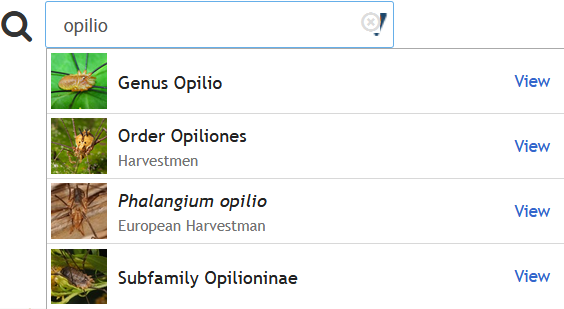

# pyinaturalist


[](https://github.com/niconoe/pyinaturalist/actions)
[](https://pyinaturalist.readthedocs.io/en/stable/)
[](https://pyinaturalist.readthedocs.io/en/latest/)
[](https://coveralls.io/github/niconoe/pyinaturalist?branch=master)
[](https://pypi.org/project/pyinaturalist)
[](https://pypi.org/project/pyinaturalist)
[](https://pypi.org/project/pyinaturalist)

Python client for the [iNaturalist APIs](https://www.inaturalist.org/pages/api+reference).
See full documentation at https://pyinaturalist.readthedocs.io.

## Installation

Install the latest stable version with pip:

```bash
$ pip install pyinaturalist
```

Or, if you would like to use the latest development (non-stable) version:

```bash
$ pip install --pre pyinaturalist
```

To set up for local development (preferably in a new virtualenv):

```bash
$ git clone https://github.com/niconoe/pyinaturalist.git
$ cd pyinaturalist
$ pip install -Ue ".[dev]"
```

To install with minimal dependencies (disables optional features):

```bash
$ pip install --no-deps pyinaturalist
$ pip install python-dateutil requests
```

## Development Status

Pyinaturalist is under active development. Currently, a handful of the most relevant API endpoints
are implemented, including:

* Searching, creating, and updating observations and observation fields
* Searching for places, projects, species, and species counts
* Text search autocompletion for species and places

See below for some examples,
see [Endpoints](https://pyinaturalist.readthedocs.io/en/latest/endpoints.html) for a complete list of implemented endpoints, and
see [Issues](https://github.com/niconoe/pyinaturalist/issues) for planned & proposed features.

More endpoints will continue to be added as they are needed.
Please **create an issue** if there is an endpoint you would like to have added, and **PRs are welcome!**

**Note:**

The two iNaturalist APIs expose a combined total of 103 endpoints\*. Some of these are generally
useful and could potentially be added to pyinaturalist, but many others are primarily for
internal use by the iNaturalist web application and mobile apps, and are unlikely to be added
unless there are specific use cases for them.

\*As of 2020-10-01: 37 in REST API, 65 in Node API, and 1 undocumented

## Examples

### Observations

#### Search observations

```python
from pyinaturalist.node_api import get_all_observations
obs = get_all_observations(user_id='my_username')
```

See [available parameters](https://api.inaturalist.org/v1/docs/#!/Observations/get_observations/)

#### Get an access token

For authenticated API calls (creating/updating/deleting data), you first need to obtain an access token.
This requires creating an [iNaturalist app](https://www.inaturalist.org/oauth/applications/new).

```python
from pyinaturalist.auth import get_access_token
token = get_access_token(
    username='my_username',
    password='my_password',
    app_id='my_app_id',
    app_secret='my_app_secret',
)
```
See [Authentication](https://pyinaturalist.readthedocs.io/en/latest/general_usage.html#authentication)
for additional authentication options, including environment variables and keyring services.

#### Create a new observation
```python
from pyinaturalist.rest_api import create_observation
from datetime import datetime

response = create_observation(
    taxon_id=54327,  # Vespa Crabro
    observed_on_string=datetime.now().isoformat(),
    time_zone='Brussels',
    description='This is a free text comment for the observation',
    tag_list='wasp, Belgium',
    latitude=50.647143,
    longitude=4.360216,
    positional_accuracy=50, # meters,
    # sets vespawatch_id (an observation field whose ID is 9613) to the value '100'.
    observation_fields={9613: 100},
    access_token=token,
)
new_observation_id = response[0]['id']
```

#### Upload a picture for this observation
```python
from pyinaturalist.rest_api import add_photo_to_observation

r = add_photo_to_observation(
    new_observation_id,
    access_token=token,
    photo='/Users/nicolasnoe/vespa.jpg',
)
```

#### Update an existing observation of yours
```python
from pyinaturalist.rest_api import update_observation

r = update_observation(
    17932425,
    access_token=token,
    description='updated description !',
)
```

#### Get a list of all (globally available) observation fields
```python
from pyinaturalist.rest_api import get_all_observation_fields
r = get_all_observation_fields(search_query="DNA")
```

#### Set an observation field value on an existing observation
```python
from pyinaturalist.rest_api import put_observation_field_values

put_observation_field_values(
    observation_id=7345179,
    observation_field_id=9613,
    value=250,
    access_token=token,
)
```

#### Get observation data in alternative formats
A separate endpoint can provide other data formats, including Darwin Core, KML, and CSV:

```python
from pyinaturalist.rest_api import get_observations
obs = get_observations(user_id='niconoe', response_format='dwc')
```

See [available parameters and formats](https://www.inaturalist.org/pages/api+reference#get-observations)

#### Get observation species counts
There is an additional endpoint to get counts of observations by species.
On the iNaturalist web UI, this information can be found on the 'Species' tab of search results.
For example, to get the counts of all your own research-grade observations:

```python
from pyinaturalist.node_api import get_observation_species_counts
obs_counts = get_observation_species_counts(user_id='my_username', quality_grade='research')
```

### Taxonomy

#### Search species and other taxa
Let's say you partially remember either a genus or family name that started with **'vespi'**-something:

```python
>>> from pyinaturalist.node_api import get_taxa
>>>
>>> response = get_taxa(q="vespi", rank=["genus", "family"])
>>> print({taxon["id"]: taxon["name"] for taxon in response["results"]})
{52747: "Vespidae", 84737: "Vespina", 92786: "Vespicula", 646195: "Vespiodes", ...}
```

Oh, that's right, it was **'Vespidae'**! Now let's find all of its subfamilies using its taxon ID
from the results above:

```python
>>> response = get_taxa(parent_id=52747)
>>> print({taxon["id"]: taxon["name"] for taxon in response["results"]})
{343248: "Polistinae", 84738: "Vespinae", 119344: "Eumeninae", 121511: "Masarinae", ...}
```

### Get a species by ID
Let's find out more about this 'Polistinae' genus. We could search for it by name or by ID,
but since we already know the ID from the previous search, let's use that:

```python
>>> from pyinaturalist.node_api import get_taxa_by_id
>>> response = get_taxa_by_id(343248)
```

There is a lot of info in there, but let's just get the basics for now:

```python
>>> basic_fields = ["preferred_common_name", "observations_count", "wikipedia_url", "wikipedia_summary"]
>>> print({f: response["results"][0][f] for f in basic_fields})
{
    "preferred_common_name": "Paper Wasps",
    "observations_count": 69728,
    "wikipedia_url": "http://en.wikipedia.org/wiki/Polistinae",
    "wikipedia_summary": "The Polistinae are eusocial wasps closely related to the more familiar yellow jackets...",
}
```

#### Taxon autocomplete
This is a text search-optimized endpoint that provides autocompletion in the Naturalist web UI:



This one is a bit more niche, but it provides a fast way to search the iNaturalist taxonomy
database. Here is an example that will run searches from console input:

```python
from pyinaturalist.node_api import get_taxa_autocomplete

while True:
    query = input("> ")
    response = get_taxa_autocomplete(q=query, minify=True)
    print("\n".join(response["results"]))
```

Example usage:

```
> opilio
527573:     Genus Opilio
47367:      Order Opiliones (Harvestmen)
84644:      Species Phalangium opilio (European Harvestman)
527419:     Subfamily Opilioninae
...
> coleo
372759:     Subclass Coleoidea (Coleoids)
47208:      Order Coleoptera (Beetles)
359229:     Species Coleotechnites florae (Coleotechnites Flower Moth)
53502:      Genus Brickellia (brickellbushes)
...
<Ctrl-C>
```

If you get unexpected matches, the search likely matched a synonym, either in the form of a
common name or an alternative classification. Check the `matched_term` property for more
info. For example:

```python
>>> first_result = get_taxa_autocomplete(q='zygoca')['results'][0]
>>> first_result["name"]
"Schlumbergera truncata"
>>> first_result["matched_term"]
"Zygocactus truncatus"  # An older synonym for Schlumbergera
```
